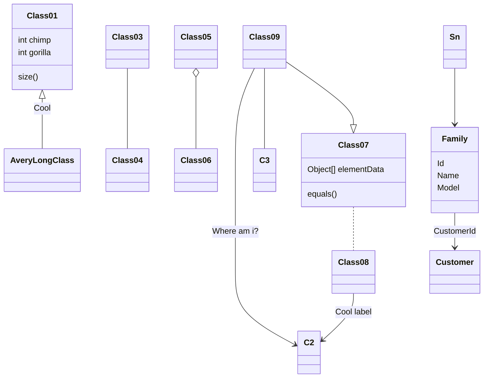

```mermaid

classDiagram
Class01 <|-- AveryLongClass : Cool
Class03 -- Class04
Class05 o-- Class06
Class07 .. Class08
Class09 --> C2 : Where am i?
Class09 -- C3
Class09 --|> Class07
Class07 : equals()
Class07 : Object[] elementData
Class01 : size()
Class01 : int chimp
Class01 : int gorilla
Class08 --> C2: Cool label
Family --> Customer : CustomerId
Family : Id
Family : Name
Family : Model
Sn --> Family
```

<!--stackedit_data:
eyJoaXN0b3J5IjpbLTE4OTgyMTY4NzldfQ==
-->