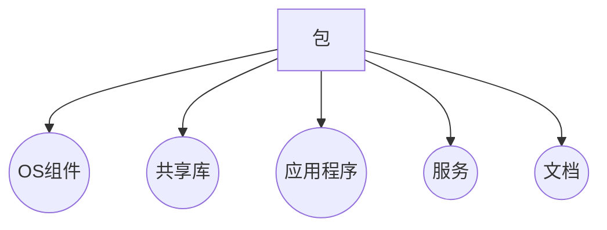
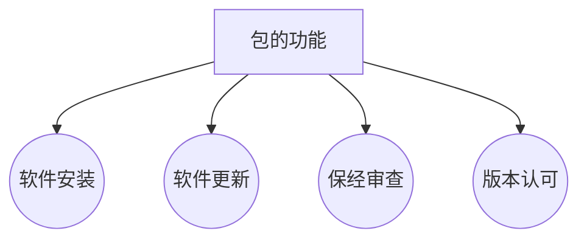
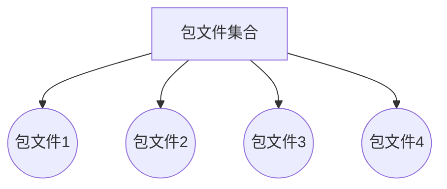
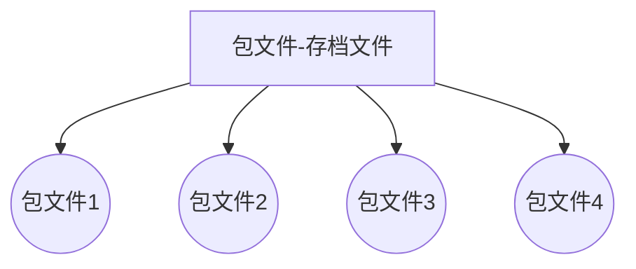

# 包管理
>读书笔记：[Linux 包管理基础：apt、yum、dnf 和 pkg](https://linux.cn/article-8782-1.html)

> Written with [StackEdit](https://stackedit.io/).
<!--stackedit_data:
eyJoaXN0b3J5IjpbLTE4NTQ5OTQwNzEsMTk4MDk4NzAxNiw3Mz
A5OTgxMTZdfQ==
-->