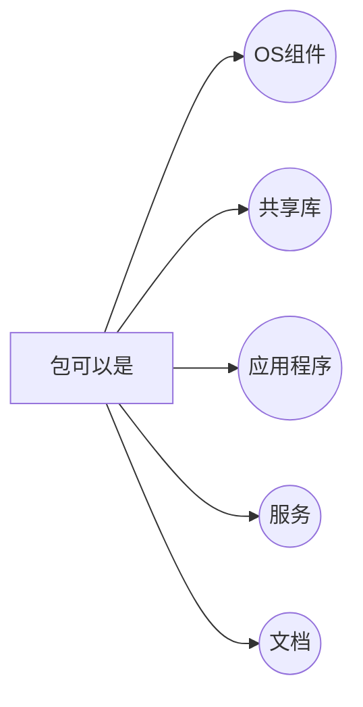
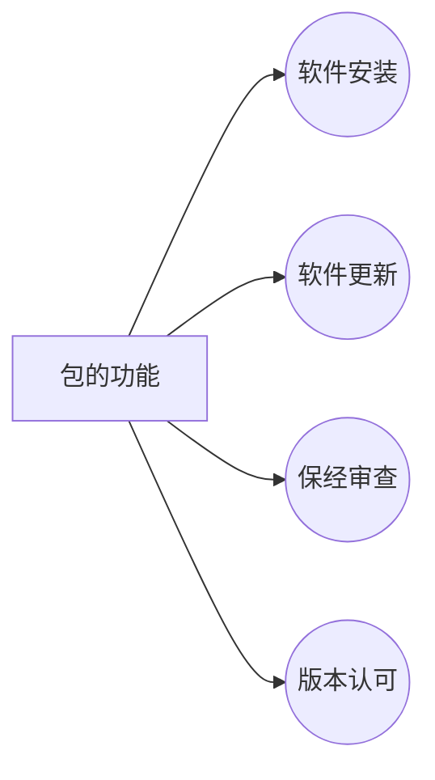
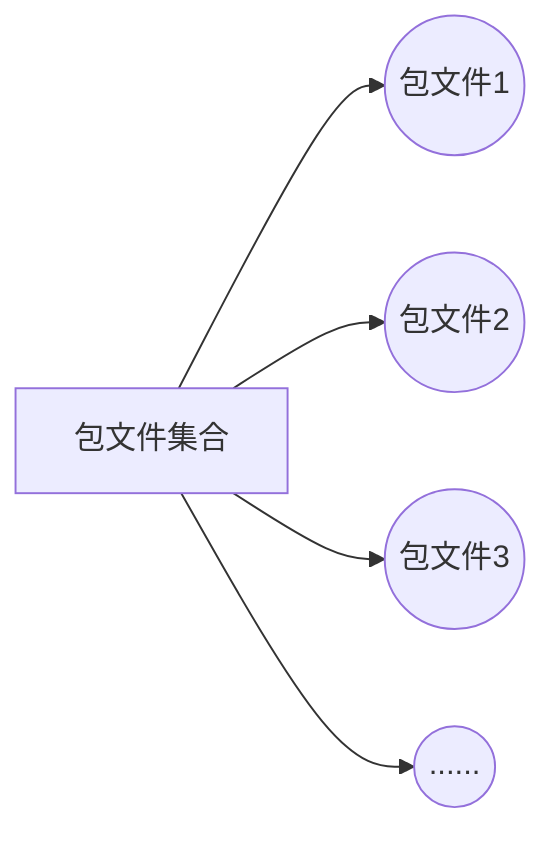
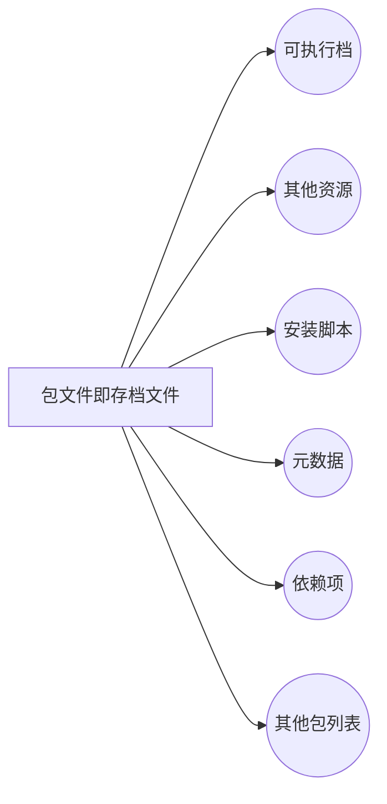

# 包管理
>读书笔记：[Linux 包管理基础：apt、yum、dnf 和 pkg](https://linux.cn/article-8782-1.html)

|OS|格式|工具|
|--|--|--|
|Debian|.deb|apt, apt-cache, apt-get, dpkg|
|Ubuntu|.deb|apt, apt-cache, apt-get, dpkg|
||||
||||
||||

> Written with [StackEdit](https://stackedit.io/).
<!--stackedit_data:
eyJoaXN0b3J5IjpbLTE4OTA2MzM0MjQsLTE3OTQ5MjU5MjEsOT
czMTAxNzk0LDE5ODA5ODcwMTYsNzMwOTk4MTE2XX0=
-->