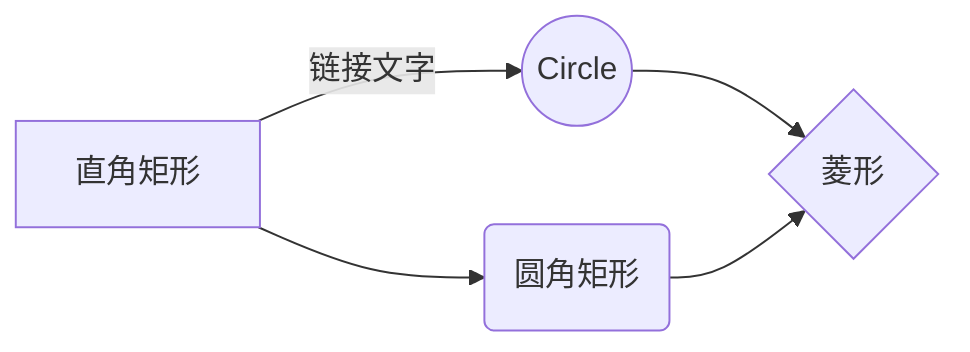

# 欢迎来到StackEdit！

嗨！我是你的第一个**StackEdit**文件。如果你想了解StackEdit，你阅读我。如果您想玩转Markdown，可以编辑我。如果您已经完成了我，可以通过打开导航栏左上角的**New file**来创建新文件。


# 文件

StackEdit把您的文件存储在您的浏览器，这意味着您的所有文件会自动保存到本地，都可以**下线**访问

## 创建文件和文件夹

可以使用导航栏左上角的按钮访问文件资源管理器。您可以通过单击文件资源管理器中的**New file**按钮来创建新文件。您还可以通过单击**New folder**按钮来创建文件夹。

## 切换到另一个文件

您的所有文件都列在文件资源管理器中。您可以通过单击列表中的文件从一个切换到另一个。

## 重命名文件

您可以通过单击导航栏中的文件名或单击文件资源管理器中的**Rename**按钮来重命名当前文件。

## 删除文件

您可以通过单击文件资源管理器中的**Remove**按钮来删除当前文件。该文件将被移动到** Trash **文件夹中，并在7天不活动后自动删除。

## 导出文件

您可以通过单击菜单中的**Export to disk**来导出当前文件。您可以选择将文件导出为纯Markdown，或使用Handlebars模板的HTML，或导出为PDF。


# 同步

同步是StackEdit的最大特色之一。它使您可以将工作区中的任何文件同步存储在**Google Drive**，**Dropbox**和**GitHub**的帐户中。这使您可以继续在其他设备上书写文件，以及与共享文件的人协作，轻松集成到您的工作流程...... 同步机制在后台每分钟进行一次，下载，合并和上传文件修改。

有两种类型的同步，它们可以相互补充：

- 工作区同步将自动同步您所有的文件，文件夹和设置。这将允许您在任何其他设备上获取工作区。	
	> 要启动同步工作区，只需在菜单中使用Google登录即可。
- 文件同步将使工作区的一个文件与 **Google Drive**，**Dropbox** 或 **GitHub** 中的一个或多个文件同步。	
	> 在开始同步文件之前，您必须在 **Synchronize**子菜单中链接一个帐户。

## 打开一个文件
您可以从打开文件**Google Drive**，**Dropbox**或 **GitHub**，方法是打开 **Synchronize**子菜单，然后点击**从打开Open from**。在工作区中打开后，文件中的任何修改都将自动同步。

## 保存文件

您可以保存工作区中的任何文件到**Google Drive**, **Dropbox** 或 **GitHub**上，方法是打开**Synchronize**子菜单，然后点击**Save on**。即使工作区中的文件已同步，您也可以将其保存到其他位置。StackEdit可以将一个文件与多个位置和帐户同步。

## 同步文件

一旦您的文件链接到同步位置，StackEdit将通过定期下载/上传任何修改来对它做同步。如有必要，将执行合并，并解决冲突。

如果您刚刚修改了文件并想要强制同步，请单击导航栏中的**Synchronize now**按钮。

> **注：** 如果你没有任何文件链接同步位置，**Synchronize now** 按钮是无效的。 

## 管理文件同步

由于一个文件可以与多个位置进行同步，你可以通过单击**File synchronization**的**Synchronize**子菜单列出并管理同步位置。允许您列出和删除链接到您的文件的同步位置。


# 发布

在StackEdit中发布使您可以轻松地在线发布文件。一旦您对文件感到满意，您就可以将其发布到不同的托管平台，例如**Blogger**，**Dropbox**，**Gist**，**GitHub**，**Google Drive**，**WordPress**和**Zendesk**。使用[Handlebars templates](http://handlebarsjs.com/)，您可以完全控制导出的内容。

> 在开始发布之前，您必须在**Publish**子菜单中链接一个帐户。

## 发布文件

您可以通过打开**Publish**子菜单并单击**Publish to**来发布文件。对于某些位置，您可以选择以下格式：

- Markdown：在可以解释它的网站上发布Markdown文本（例如**GitHub**），
- HTML：通过Handlebars模板（例如在博客上）发布转换为HTML的文件。


## 更新出版物

发布后，StackEdit会将您的文件链接到该出版物，以便您轻松重新发布。修改文件并想要更新出版物后，单击导航栏中的**立即发布**按钮。

> **注意:** 如果您的文件尚未发布，则**Publish now**按钮被禁用。 

## 管理文件发布

由于一个文件可以被发布到多个位置，你可以列出和管理通过点击发布位置**File publication**的**Publish**子菜单。这允许您列出和删除链接到您的文件的发布位置。

# Markdown 扩宽

StackEdit通过添加额外的** Markdown extensions**扩展了标准Markdown语法，为您提供了一些不错的功能。

> **ProTip：** 您可以在**File properties**对话框中禁用任何** Markdown扩展**。 


## SmartyPants

SmartyPants将ASCII标点符号转换为“智能”排版标点符号HTML实体。例如：
|                |ASCII                          |HTML                         |
|----------------|-------------------------------|-----------------------------|
|Single backticks|`'Isn't this fun?'`            |'Isn't this fun?'            |
|Quotes          |`"Isn't this fun?"`            |"Isn't this fun?"            |
|Dashes          |`-- is en-dash, --- is em-dash`|-- is en-dash, --- is em-dash|


            


## KaTeX

您可以使用[ KaTeX ](https://khan.github.io/KaTeX/)渲染LaTeX数学表达式：

The *Gamma function* satisfying $\Gamma(n) = (n-1)!\quad\forall n\in\mathbb N$ is via the Euler integral

在*伽玛功能*满足$ \伽玛( ñ) = ( N-1)！ \ quad \ forall n \ in \ mathbb N $是通过Euler积分

$$               \ Gamma（z）= \ int _0 ^ \ infty t ^ { z-1 } e ^ { -t } dt \ ,. $$


> 您可以在[ 此处 ]（http://meta.math.stackexchange.com/questions/5020/mathjax-basic-tutorial-and-quick-reference）找到有关** LaTeX **数学表达式的更多信息。


## UML图

您可以使用[ Mermaid ]（https://mermaidjs.github.io/）呈现UML图表。例如，这将生成一个序列图：

```美人鱼
序列
图表爱丽丝 -  >>鲍勃：你好鲍勃，你好吗？
鲍勃 -  >>约翰：约翰，你呢？
鲍勃 -  x爱丽丝：我很感谢！
Bob-x John：我很感谢！
注意约翰的权利：鲍勃认为很长很长一段时间，因为文本不适合连续。鲍勃 - >爱丽丝：和约翰一起检查......爱丽丝 - > 约翰：是的......约翰，你好吗？
```


这将产生一个流程图：



<!--stackedit_data:
eyJwcm9wZXJ0aWVzIjoiYXV0aG9yOiBSaXN1biBKaWFuZ1xuZG
F0ZTogJzIwMTgtMDgtMTUnXG4iLCJoaXN0b3J5IjpbLTEzNDMy
NDA0OCwxODE3OTU2Njc4LDI0OTAzNjAyMywtMTY4MDUyNTc1Ni
wtMTU1NzAwOTczMSwtMzEyODgxNjU3LDE1MjkzMjM1NjEsMTEx
NjQwMzQyNV19
-->